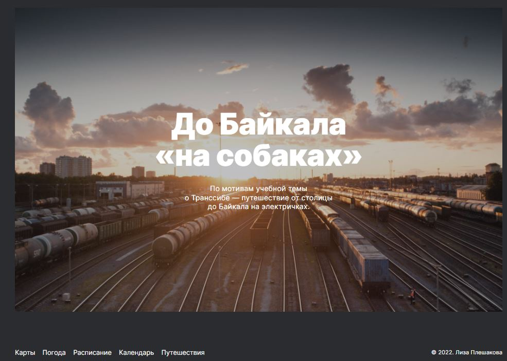

# Путешествие по России
---
Добро пожаловать в проект "Путешествие по России"! Этот проект - веб-сайт, посвященный удивительным природным и культурным достопримечательностям России. Здесь вы найдете информацию о различных местах, которые стоит посетить в этой огромной и разнообразной стране.



## Ссылка на сайт

[Путешествие по России](https://lizapleshakova.github.io/russian-travel/)

## Описание проекта

Этот проект создан с использованием HTML и CSS, а также включает в себя следующие разделы:

- Информация о различных местах в России.
- Красочные изображения и фотографии достопримечательностей.
- Ссылки на источники и дополнительную информацию о каждом месте.
- Респонсивный дизайн, обеспечивающий корректное отображение на разных устройствах.

Сайт сверстан по макету из Figma [Ссылка на макет](https://www.figma.com/file/5S2WSbEFL6awjVWJ0NWL8Q/Sprint-3_-Russia-_-desktop-mobile?node-id=28503%3A0)

## Как начать

Если вы хотите запустить этот проект локально на своем компьютере, вам потребуется клонировать репозиторий:

```bash
git clone https://github.com/lizapleshakova/russian-travel.git
```

## Стек
* HTML
* CSS

## Что использовано
* Flexbox
* Grid Layout
* Анимация
* Адаптивная верстка
* BEM

## Что запланировано
Адаптировать сайт для других расширений экранов


